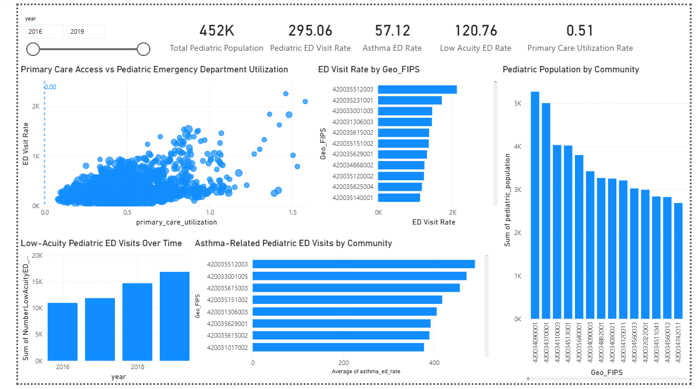

# pediatric-ed-utilization-population-health-analytics

Population health analytics dashboard analyzing **pediatric emergency department utilization, asthma-related ED demand, and primary care access across communities using population-normalized healthcare metrics.**

This project uses pediatric healthcare utilization data from the **UPMC Pediatric Population Health dataset provided through the University of Pittsburgh Record Research Request Service (R3)** covering **2016–2019 across census block groups in Allegheny County, Pennsylvania.**

The analysis identifies communities with **elevated pediatric emergency department utilization, potential gaps in primary care access, and clinical drivers of pediatric emergency demand.**

---

# Dashboard



The Power BI dashboard visualizes pediatric healthcare utilization patterns and enables stakeholders to identify **high-priority intervention communities.**

---

# Project Objective

The goal of this project is to analyze pediatric healthcare utilization patterns across communities and identify **population health insights that can support healthcare planning and preventative care programs.**

The dashboard answers key healthcare analytics questions:

- Which communities have the **highest pediatric emergency department utilization?**
- How does **primary care utilization relate to emergency department demand?**
- What **clinical factors (such as asthma)** drive pediatric ED visits?
- Are **low-acuity (non-urgent) ED visits increasing over time?**
- Where are the **largest pediatric populations located?**

---

# Dataset Description

The analysis integrates multiple datasets related to pediatric healthcare utilization.

## Emergency Department Dataset

Source: **UPMC Pediatric Emergency Department Data**

Includes:

- Pediatric emergency department visit counts
- Asthma-related ED visits
- Low-acuity ED visits
- ED utilization by census geography

File:

```
data/r3_ed_opendata.csv
```

---

## Primary Care Utilization Dataset

Source: **UPMC Primary Care Utilization Data**

Includes:

- Pediatric primary care visit rates
- Primary care utilization by census block group

File:

```
data/r3_primarycare_opendata.csv
```

---

## Final Analytical Dataset

The final dataset was engineered by integrating the ED dataset and primary care dataset along with pediatric population estimates.

Features include:

- Census tract identifiers (`Geo_FIPS`)
- Pediatric population
- Pediatric ED visit counts
- Asthma-related ED visits
- Low-acuity ED visits
- Primary care utilization rates

File:

```
data/pediatric_population_health_dataset.csv
```

---

# Data Processing Pipeline

The project follows an end-to-end analytics workflow.

```
Raw Healthcare Data
      ↓
Data Cleaning & Transformation (Python / Pandas)
      ↓
Population Health Metric Engineering
      ↓
Final Analytical Dataset
      ↓
Power BI Population Health Dashboard
```

Data transformations were performed in:

```
notebook/Pediatric_ED_Utilization_Project.ipynb
```

Key processing steps:

- Data cleaning and preprocessing
- Merging ED and primary care datasets
- Engineering population-normalized healthcare metrics
- Preparing analytical datasets for Power BI visualization

---

# Population Health Metrics

The dashboard includes several key healthcare utilization metrics.

### Pediatric ED Visit Rate
**ED Visits per 1,000 Children**

Measures overall pediatric emergency department demand.

---

### Asthma ED Visit Rate
**Asthma-related ED visits per 1,000 children**

Asthma is one of the **most common drivers of pediatric emergency department utilization.**

---

### Low-Acuity ED Visit Rate
**Low-acuity ED visits per 1,000 children**

Represents ED visits that could potentially be treated in **primary care or urgent care settings.**

---

### Primary Care Utilization Rate
Measures **primary care engagement relative to pediatric population size.**

This metric helps evaluate **community access to outpatient pediatric healthcare.**

---

# Key Insights

## 1. Pediatric ED utilization varies significantly across communities

Certain census tracts show **substantially higher ED visit rates**, indicating potential disparities in healthcare access or community health needs.

These areas may benefit from **targeted population health programs and healthcare outreach.**

---

## 2. Asthma is a major driver of pediatric emergency utilization

Several communities demonstrate **high asthma-related ED visit rates**, suggesting opportunities for preventative interventions such as:

- School-based asthma education programs
- Improved inhaler access
- Environmental health interventions

---

## 3. Low-acuity ED visits are increasing over time

Between **2016 and 2019**, the dashboard shows a **steady increase in low-acuity pediatric ED visits**.

This trend suggests opportunities for healthcare systems to reduce ED congestion through:

- Expanded urgent care access
- Telehealth triage programs
- Increased primary care capacity

---

## 4. Pediatric population distribution highlights intervention priorities

Combining pediatric population size with ED utilization patterns helps identify **communities where preventative healthcare initiatives could have the greatest impact.**

---

# Tools & Technologies

- Python
- Pandas
- Jupyter Notebook
- Power BI

Analytics techniques used:

- Population health analytics
- Healthcare utilization analysis
- Population-normalized rate calculations
- Community-level health analysis
- Interactive data visualization

---

# Repository Structure

```
Power BI/
    Population_Health_Analytics.pbix

data/
    r3_ed_opendata.csv
    r3_primarycare_opendata.csv
    pediatric_population_health_dataset.csv

notebook/
    Pediatric_ED_Utilization_Project.ipynb

images/
    dashboard.png
```

This repository demonstrates a **complete healthcare analytics workflow**:

```
Raw Healthcare Data
      ↓
Data Cleaning & Integration
      ↓
Population Health Metric Engineering
      ↓
Interactive Power BI Dashboard
```

---

# Potential Applications

This analysis framework can support:

- Hospital population health teams
- Public health planning initiatives
- Healthcare utilization monitoring
- Preventative pediatric healthcare programs
- Community health resource allocation

---

# Author

**Anurag Koripalli**  
Purdue University  
Business Analytics & Information Management
